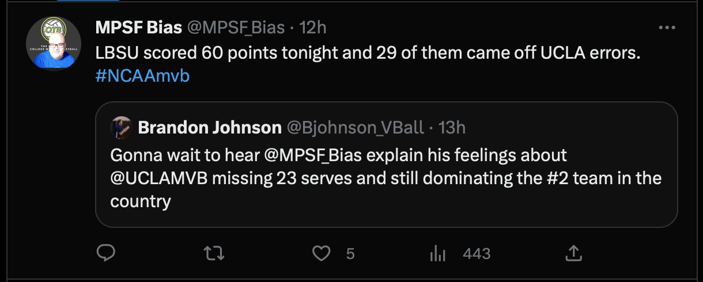

```{r setup, include=FALSE}
knitr::opts_chunk$set(echo = TRUE,
                      warning=FALSE,
                      message=FALSE,
                      out.width = "100%")
```

Oh hello! I had a spark of motivation to dust off this blog and refresh my memory on how to put a post together here. The cause of this spark? Last night, I was at the UCLA vs. Long Beach match in which UCLA handed Long beach their first loss of the season in convincing fashion, winning 25-19, 25-21, 25-20. While that result in itself may not be all that surprising depending who you ask (see: https://vbelo.substack.com/p/vbelo-scouting-report-february-09), one particular metric stood out in the match which was UCLA committing 23 service errors to Long Beach's 9. 



So, let's talk about service errors! More specifically, I'd like to attempt to provide some context to service errors with some data. 

Taking a sample of 257 international men's matches since 2021 (962 sets played), I parsed the data to get serve error percentage (`sepct`), ace percentage (`acepct`), and overall point scoring percentage (`pspct`) for each team in each set and paired that with the score margin (`score_margin`). 

```{r include = FALSE, echo = FALSE}

library(tidyverse)
library(datavolley)
source("/Users/nngo/rwd/usa_data_prep/data0_base_prep.R")

international_data <- read_rds("/Users/nngo/Desktop/2122total.RDS") %>%
  get_data0()

```

```{r}
# load in tidyverse packages to work with the data
library(tidyverse)

# parse data into the metrics we want, including some identifiers for each row of data
se_data_int <- international_data %>%
  filter(sk == 1) %>%
  group_by(date,match_id,team_id,opp_team_id,team_id_wonlost_set,set_number,wonlost_set,set_margin) %>%
  summarise(sepct = mean(sk.grd == 1),
            acepct = mean(sk.grd == 6),
            pspct = mean(wonlost == 1),
            .groups = "drop")
```

Always a good idea to see what the data looks like visually, so I paired serve error percentage with set margin, and included the regression line based off of the linear regression model fit for this data.

```{r}
ggplot(se_data_int,
       aes(x = sepct,
           y = set_margin)) +
  geom_point() +
  geom_smooth(method = "lm",
              formula = "y ~ x") +
  labs(title = "Serve Error Percentage x Set Margin by Set Played",
       subtitle = "International Men (2021-2022)",
       x = "Serve Error Percentage",
       y = "Set Score Margin")
```

On first glance, the regression line has a negative slope as we would expect - missing more serves seems like it should decrease the margin of which a team would win/increase the margin of losing a set. But the steepness of the slope seems to be rather flat, and the fit of the model relative to the data points doesn't seem to be a great fit (lots of variation of points away from the line). Let's see what the metrics of running the linear model say about this.

```{r}
# load in packages from the tidymodels package to assess statistical models
library(tidymodels)

# run the linear model for serve errors and set margin and store it in sepct_lm
sepct_lm <- lm(formula = set_margin ~ sepct, data = se_data_int)

# get the model fitting metrics using parsnip::glance(), particularly R^2
sepct_lm %>% glance()

```

Looking at the `r.squared` value of 0.0564 confirms the poor fit of this linear model, or in other words, the model does not explain much of the variation in the response variable (set margin) around its mean. I'm happy to be educated otherwise, but I would interpret this to mean serve error percentage is a poor predictor for set score margin (i.e. winning/losing sets).

For comparison sake, let's use this same process and see how point scoring percentage relates to set score margin. Here's what the data looks like:

```{r}
ggplot(se_data_int,
       aes(x = pspct,
           y = set_margin)) +
  geom_point() +
  geom_smooth(method = "lm",
              formula = "y ~ x") +
  labs(title = "Point Scoring Percentage x Set Margin by Set Played",
       subtitle = "International Men (2021-2022)",
       x = "Point Scoring Percentage",
       y = "Set Score Margin")
```

And the metrics for the model:

```{r}
pspct_lm <- lm(formula = set_margin ~ pspct, data = se_data_int)

pspct_lm %>% glance()
```

Pretty clear to see how much better of a fit Point Scoring is to Set Score Margin, and the `r.squared` value of 0.633 confirms that. This makes sense as the points you score on serve should track well with how much you win or lose a set by; the other major factor being side out percentage. 

Just for fun, let's see how aces/ace percentage tracks with the score margin:

```{r}
ggplot(se_data_int,
       aes(x = acepct,
           y = set_margin)) +
  geom_point() +
  geom_smooth(method = "lm",
              formula = "y ~ x") +
  labs(title = "Ace Percentage x Set Margin by Set Played",
       subtitle = "International Men (2021-2022)",
       x = "Ace Percentage",
       y = "Set Score Margin")
```

```{r}
acepct_lm <- lm(formula = set_margin ~ acepct, data = se_data_int)

acepct_lm %>% glance()
```

A bit better than serve errors, but again, not a great fit. Again, this makes sense as aces are relative uncommon within a set, and is only a small portion of how points are scored on serve.

With all this said, let's run this analysis one more time, but using some NCAA Men's data. Here I sample from 113 matches (457 sets) from 2022.

```{r echo = FALSE, include = FALSE}

ncaa_data <- read_rds("/Users/nngo/Desktop/ncaa_files.RDS") %>%
  get_data0()

```

```{r}
# parse data into the metrics we want, including some identifiers for each row of data
se_data_ncaa <- ncaa_data %>%
  filter(sk == 1) %>%
  group_by(date,match_id,team_id,opp_team_id,team_id_wonlost_set,set_number,wonlost_set,set_margin) %>%
  summarise(sepct = mean(sk.grd == 1),
            acepct = mean(sk.grd == 6),
            pspct = mean(wonlost == 1),
            .groups = "drop")

ggplot(se_data_ncaa,
       aes(x = sepct,
           y = set_margin)) +
  geom_point() +
  geom_smooth(method = "lm",
              formula = "y ~ x") +
  labs(title = "Serve Error Percentage x Set Margin by Set Played",
       subtitle = "NCAA Men (2022)",
       x = "Serve Error Percentage",
       y = "Set Score Margin")

```

Looks fairly similar to the International Men data.

```{r}
sepct_ncaa_lm <- lm(formula = set_margin ~ sepct, data = se_data_ncaa)

sepct_ncaa_lm %>% glance()
```

And the test metrics confirm this.

## Summing It Up

When it comes to high level volleyball, service errors are a poor predictor of winning and losing. As the data shows, there is a lot of variance when it comes to set score margin as it relates to serve error percentage within a set. Strategically speaking, attackers are getting more and more physical and putting balls away at a very high rate in system, and an effective way to improve the chances of defending an opponent's attack is by creating easier opportunities to defend or even score direct points through serve pressure. Service errors are a byproduct of this strategy, sure, but I'd argue that if a coach were to not allow servers to "go for it" for wanting to minimize errors, then that coach is actually limiting the team from an avenue to potentially score points on serve, relying solely on defense (i.e. the "just get it in" strategy, and also, REALLY tough to do at the higher levels of the game). On top of that, it would seem rather difficult for a player to improve upon a tough serve if the coach is creating an environment that strictly discourages service errors. 

All in all, I'm not saying fans or observers of the sport can't or shouldn't be annoyed by missed serves. This is just to provide some evidence and understanding that missed serves are likely NOT the reason a team wins or loses, and that there are reasons that they happen as much as they do for some teams. 
